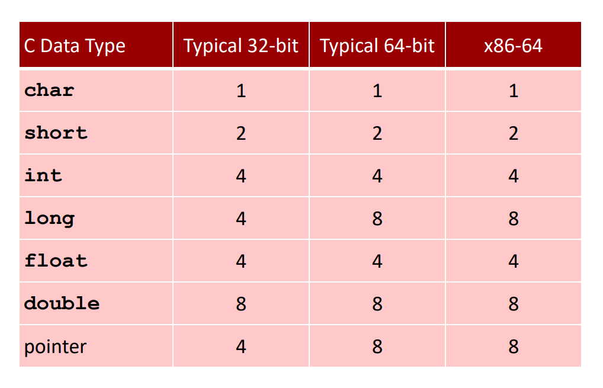
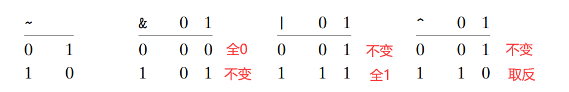
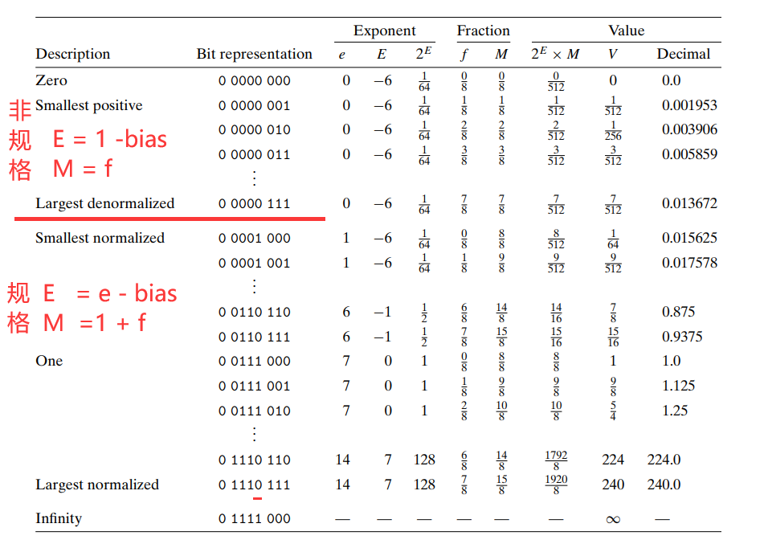
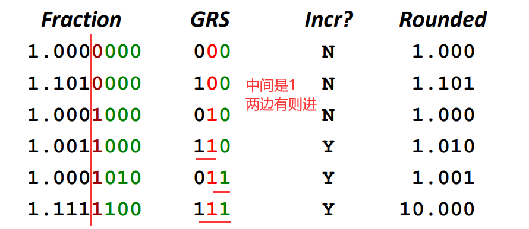

# Representing and Manipulating Information

整数运算遵循: 结合律、交换律、分配律
浮点运算**不**遵循结合律

指针的值：某个存储块的第一个字节的虚拟地址,类型等信息位于上下文

gcc -m32 prog.c
gcc -m64 prog.c

大端法：往地址大的方向读
小端法：往地址小的方向读

a ^ a = 0

2^10 = 1024 ~ 10^3
32位 2^32 ~ 2^30 ~ 10^9
64位 2^64 ~ 2^60 ~ 10^19

UMax = 2TMax + 1

类型转换,底层比特位不变，上下文变

趋向无符号转换

-x == ~x + 1
-TMIN还是自身

short su = 0xcfc7;
unsigned uy = su;
// uy 为 ff ff cf c7
(unsigned) su -> (unsigned) (int) su

无符号数正确的loop使用
for(i = cnt-2; i < cnt; i--)

舍弃溢出位,剩下的按原本上下文解释

x * 14
14 = 2^4 - 2^1
(x<<4) - (x<<1)

43210
01110  14的二进制
(x<<(n+1)) - (x<<m)

无论有符号、无符号,右移一律：
(x < 0 ? x + (1 << k)-1 : x) >> k

单精度： 1 8  23
双精度： 1 11 52

bias = 2 ^ (k-1) - 1
k为阶码比特数

