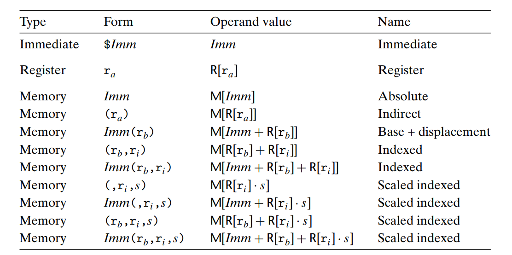
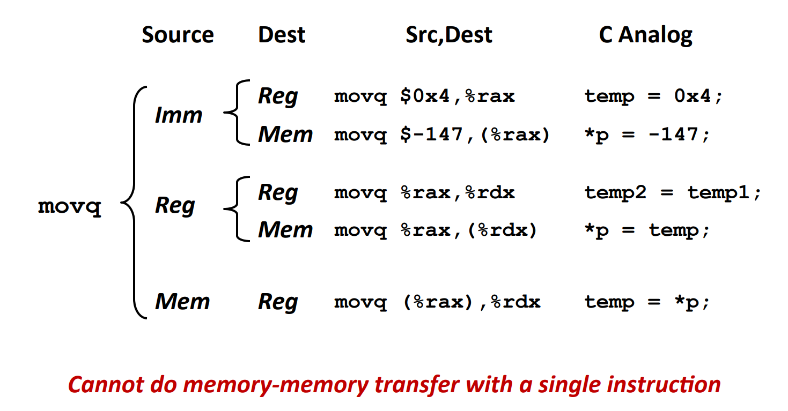
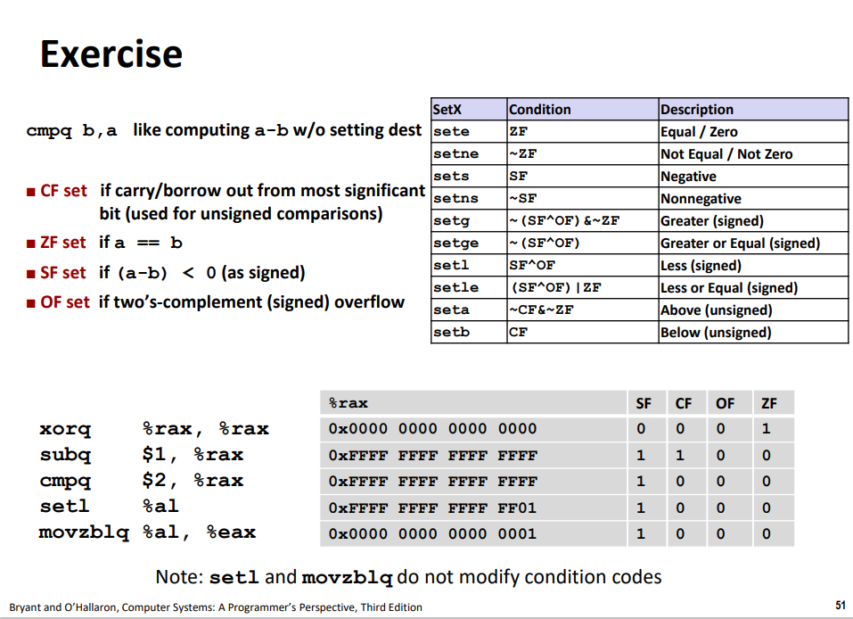

# Machine-Level Representation of Programs

gcc -Og p1.c p2.c -o p

优化等级 -Og -O1 -O2

-S 汇编代码 xx.s

-c 机器代码 xx.o

-g debug模式,方便gdb

-o 命名结果文件

%rip PC program counter

objdump -d xx.o > xx.d 反汇编

| | | | |
| - | - | - | - |
| 字节 | byte | 8 | movb |
| 字 | word | 16 | movw |
| 双字 | double word | 32 | movl |
| 四字 | quad word | 64 | movq |

生成4字节数字的指令会把高4位清零;生成1字节或2字节的高位不变

%rax 返回值
%rsp 栈指针
%rdi %rsi %rdx %rcx 参数
%cl  移位

%rdi -> R[%rdi] 寄存器%rdi的值

(Addr) -> M[Addr] 内存中从Addr开始的引用

lea 直接将src计算出的‘有效地址’写入dest

&取址操作 和 普通的算术操作

条件控制转移 conditional control transfer

条件传送     conditional move

gcc -fno-if-conversion 禁用条件传送

跳转到中间 jump to middle -Og 先jmp无条件跳转到测试部分

guarded-do -O1 先测试初始条件

switch 跳转表索引补码表示 转换成[0~n]
开关情况多，值范围跨度小
